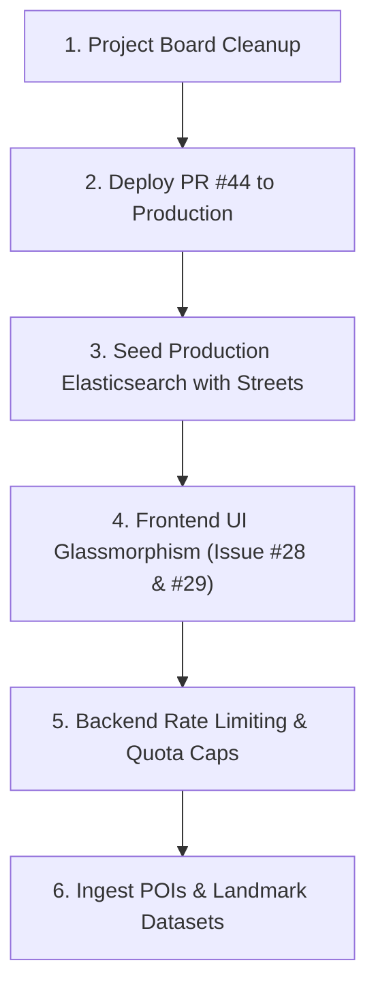

# Wayline — Roadmap & Next Steps Document

_Generated: September 2026 | Active Branch: `dev` | Lead: @YUVARAJ-R-ai | Primary Assignee: @Indhracha-05_

---

## 1. Executive Summary

Wayline has successfully completed its core architectural foundation:
* **Microservices & Monorepo**: `api-gateway` (Express), `frontend` (Next.js 15), `etl` (Python/GDAL + Flask runner), `postgres` (PostGIS), and `routing_engine` (OSRM).
* **Phase 1 MVP**: User registration, login, JWT session management, API key hashing/generation (`wlk_...`), routing dashboard, and GCC Chennai street overlay.
* **Phase 2 Geocoding Cut-over**: Replaced external OpenCage geocoding with Wayline's native **Elasticsearch 8.x** engine, supported by a dynamic Python ETL pipeline (`/api/geocode`, `/api/reverse-geocode`, `/api/data/import`).

All unclosed tasks have now been assigned to **Indhra (`@Indhracha-05`)**. This document provides an actionable step-by-step roadmap of what should be executed next across all layers of the project.

---

## 2. Immediate Action Priorities



---

### Priority 1: GitHub Project & Issue Hygiene (Immediate)

**Status:** Over 10 GitHub issues are currently OPEN despite being 100% completed and merged into `dev` (and `main`).

1. **Verify & Close Completed Issues on GitHub:**
   - [ ] Issue #6 (`Wire NextAuth to real DB`) — Completed in PR #22.
   - [ ] Issue #7 (`Add API key CRUD endpoints`) — Completed in PR #38.
   - [ ] Issue #8 (`Add protectWithApiKey middleware`) — Completed in PR #38.
   - [ ] Issue #9 (`Wire up API Keys dashboard page`) — Completed in PR #24.
   - [ ] Issue #10 (`Connect search bar to geocode API`) — Completed in PR #25.
   - [ ] Issue #16 (`Clean up api-gateway: remove geo_rev, fix OSRM`) — Completed in PR #38.
   - [ ] Issue #18 (`Build live routing dashboard: address inputs, geocode, polyline`) — Completed in PR #38.
   - [ ] Issue #27 (`Establish Wayline design tokens & theme`) — Completed in commits `d90ce4a`..`7729e4a`.
   - [ ] Issue #32 (`Stand up Elasticsearch in docker-compose`) — Completed in PR #43.
   - [ ] Issue #33 (`Build dynamic ETL normalizer`) — Completed in PR #43.
   - [ ] Issue #34 (`Swap geocoding from OpenCage to ES`) — Completed in PR #43.
   - [ ] Issue #35 (`Add POST /api/data/import to trigger ETL`) — Completed in PR #43.
2. **Commit Untracked Documentation:**
   - Commit [`docs/research-geospatial-etl.md`](file:///home/yuvaraj/Drive1/projects/maps-api/wayline/docs/research-geospatial-etl.md).

---

### Priority 2: Production Deployment & Data Seeding (Lead + Indhra)

**Status:** [PR #44](https://github.com/YUVARAJ-R-ai/wayline/pull/44) ("Deploy Phase 2: ES-native geocoding engine to production") has been open and pending review.

> [!WARNING]
> Merging PR #44 will trigger `.github/workflows/deploy.yml` to automatically rebuild production via `docker-compose.prod.yaml`. The production `es_data` volume starts empty. Geocoding endpoints will fall back to mock data until production is seeded.

**Step-by-Step Deployment Checklist:**
1. **Review & Merge [PR #44](https://github.com/YUVARAJ-R-ai/wayline/pull/44)** into `main`.
2. **Verify Production Containers**:
   ```bash
   docker compose -f docker-compose.prod.yaml ps
   ```
   Ensure `wayline_elasticsearch` and `wayline_etl_runner` are healthy.
3. **Seed Production Data**:
   Ensure `GCC_Streets.zip` is extracted into the host import directory (`IMPORT_DATA_DIR`, default `/data/vault/project_archive/maps-api`), then trigger:
   ```bash
   curl -X POST https://<your-domain>/api/data/import \
     -H "Content-Type: application/json" \
     -H "X-API-Key: <admin_or_valid_key>" \
     -d '{"file_path": "GCC_Streets.shp", "dataset_name": "gcc_streets", "recreate": true}'
   ```
4. **Smoke-Test Production Endpoints**:
   - Forward geocode: `curl "https://<your-domain>/api/geocode?q=Anna+Salai"`
   - Reverse geocode: `curl "https://<your-domain>/api/reverse-geocode?lat=13.05&lng=80.28"`

---

### Priority 3: Frontend UI Modernization (Assigned: Indhra)

Tokens were set up in [`frontend/styles/tokens.css`](file:///home/yuvaraj/Drive1/projects/maps-api/wayline/frontend/styles/tokens.css). The UI now needs to be elevated from basic Tailwind to a refined glassmorphic interface.

#### 1. Issue #28: Glassmorphic Component Library
* **Target Directory:** `frontend/components/ui/`
* **Components to Build:**
  * `GlassCard.tsx`: Background blur (`backdrop-blur-md`), subtle translucent border, hover glow.
  * `GlassButton.tsx`: Primary (warm ivory / forest green accent), secondary (ghost / outline), loading spinners.
  * `Badge.tsx`: Clean status pills (Active, Revoked, Rate-limited).
  * `Modal.tsx`: Accessible dialog overlay with blur backdrop and esc/click-outside dismiss.
* **Acceptance Criteria:**
  * Mobile-responsive.
  * Zero TypeScript / ESLint warnings.
  * Consistent with color tokens (`--bg-surface`, `--text-primary`, `--border-subtle`).

#### 2. Issue #29: Redesign API Keys Dashboard
* **Target File:** [`frontend/app/dashboard/keys/page.tsx`](file:///home/yuvaraj/Drive1/projects/maps-api/wayline/frontend/app/dashboard/keys/page.tsx)
* **Changes:**
  * Replace plain HTML tables with modern card/table layout.
  * **Key Generation Modal**: When a user creates a new key (`wlk_...`), display it in a focused modal with a one-click "Copy to Clipboard" button and a clear warning that the secret cannot be shown again.
  * **Usage Visualizer**: Progress bar or badge showing `usage_count`.
  * **Delete Confirmation**: Modal confirmation before revoking a key.

---

### Priority 4: Backend Hardening & API Gateway Upgrades (Assigned: Indhra)

#### 1. Implement API Rate Limiting & Quotas
* **Location:** [`api-gateway/app.js`](file:///home/yuvaraj/Drive1/projects/maps-api/wayline/api-gateway/app.js)
* **Problem:** Currently, [`protectWithApiKey`](file:///home/yuvaraj/Drive1/projects/maps-api/wayline/api-gateway/app.js#L38) increments `usage_count` in PostgreSQL, but does not throttle requests or block abusive callers.
* **Implementation Plan:**
  * Add tier column to `api_keys` (e.g. `tier VARCHAR(20) DEFAULT 'free'`, `rate_limit_per_min INT DEFAULT 60`).
  * Integrate an in-memory or Redis/Postgres token-bucket rate limiter.
  * Return `429 Too Many Requests` with `Retry-After` header when limit exceeded.

#### 2. Broaden Geocoding Dataset Coverage
* **Current Limitation:** The index currently holds only street polylines (from GCC streets). Queries for general neighborhoods ("Velachery", "Adyar") or landmarks ("Marina Beach") fall back to mock data or fail.
* **Next Step:**
  * Extract administrative boundary shapes, areas, and major POIs from OpenStreetMap into shapefile/GeoJSON format.
  * Ingest them into `wayline_geo` using `POST /api/data/import`.

#### 3. Deprecate Legacy Pelias Documentation
* Update [`README.md`](file:///home/yuvaraj/Drive1/projects/maps-api/wayline/README.md) and [`docs/roadmap-phase2-geocoding.md`](file:///home/yuvaraj/Drive1/projects/maps-api/wayline/docs/roadmap-phase2-geocoding.md) to document the ES-native architecture and remove references to Pelias and OpenCage.

---

## 3. Tasks Assigned to Indhra (@Indhracha-05)

All unclosed tasks on GitHub have been assigned to **@Indhracha-05**:

| Issue | Title | Category | Current Status | Next Action for Indhra |
|---|---|---|---|---|
| **#28** | Implement premium glassmorphic cards & button components | Frontend | Ready / Unstarted | **Start next:** Build UI component library in `frontend/components/ui/` |
| **#29** | Redesign API Keys page with glassmorphism tables & modals | Frontend | Ready / Unstarted | Follow up after #28 to revamp `keys/page.tsx` |
| **#6** | Wire NextAuth to real DB instead of mock users | Frontend | Code Merged | Verify & close issue on GitHub |
| **#7** | Add API key CRUD endpoints to `api-gateway` | Backend | Code Merged | Verify & close issue on GitHub |
| **#8** | Add `protectWithApiKey` middleware | Backend | Code Merged | Verify & close issue on GitHub |
| **#9** | Wire up API Keys dashboard page | Frontend | Code Merged | Verify & close issue on GitHub |
| **#10** | Connect search bar to geocode API | Frontend | Code Merged | Verify & close issue on GitHub |
| **#16** | Clean up `api-gateway`: remove geo_rev, fix OSRM env var | Backend | Code Merged | Verify & close issue on GitHub |
| **#18** | Build live routing dashboard | Frontend | Code Merged | Verify & close issue on GitHub |
| **#27** | Establish Wayline design tokens & theme foundation | Frontend | Code Merged | Verify & close issue on GitHub |
| **#32** | Stand up Elasticsearch + Pelias in docker-compose | Infrastructure | Code Merged | Verify & close issue on GitHub |
| **#33** | Build dynamic ETL normalizer (Python, any-format → ES) | Backend/ETL | Code Merged | Verify & close issue on GitHub |
| **#34** | Swap geocoding from OpenCage to Pelias/ES | Backend | Code Merged | Verify & close issue on GitHub |
| **#35** | Add `POST /api/data/import` to trigger the ETL | Backend | Code Merged | Verify & close issue on GitHub |
| **#36** | Phase 2 (optional): LLM-assisted normalization for messy data | Backend/AI | Backlog | Hold pending Ollama GPU benchmarks |
| **#37** | Phase 2 (optional): Real-time PostGIS → ES sync via Logstash | Infrastructure | Backlog | Hold pending real-time data source |

---

## 4. Suggested Execution Schedule

```
Week 1 (Sprint 6):
  Day 1: Close finished GitHub issues + Review & merge PR #44 + Seed prod ES
  Day 2-3: Implement Issue #28 (Glassmorphic cards, buttons, modals in frontend)
  Day 4-5: Implement Issue #29 (API Keys dashboard redesign)

Week 2 (Sprint 7):
  Day 6-7: Add API Key Rate Limiting in api-gateway/app.js
  Day 8-9: Ingest landmark and area dataset into Elasticsearch
  Day 10:  Documentation update & remove legacy Pelias/OpenCage references
```
